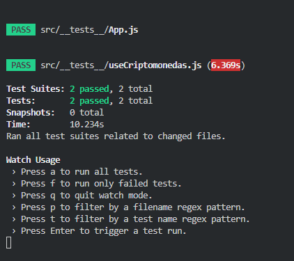

## Testing con [Jest / React-Testing-Library]

Chequeo de:

- Existencia de elementos de determinados componentes.
- Funciones.
- Probar un componente asincronico
- Uso de mocks para simular respuestas desde la base de datos.

###### Correr la aplicacion:

### `npm start`

###### Para correr los test:

### `npm run test`

